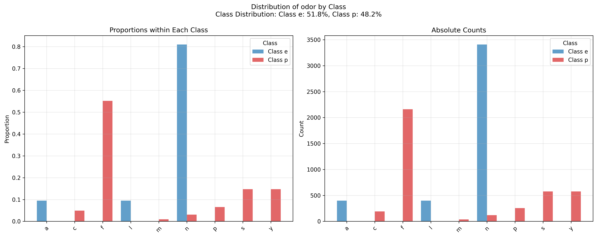
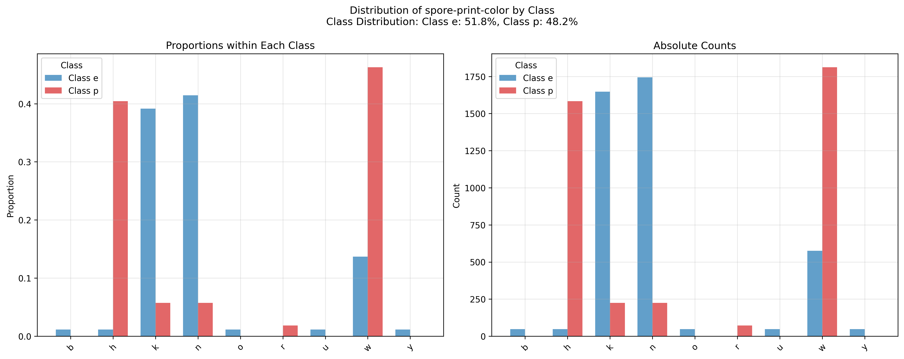

# Mushroom Poison Classification

## Introduction

Mushroom foraging can be risky due to the challenge of distinguishing between edible and poisonous species, especially 
as physical characteristics alone may not always make toxicity obvious. To address this, machine learning models have 
been applied to mushroom classification tasks, leveraging attributes such as odor, cap color, and gill characteristics 
to predict toxicity more reliably. Recent research has shown that models trained on these specific characteristics can 
significantly enhance classification accuracy, making mushroom identification safer and more accessible 
for both researchers and foragers ([Tutuncu et al., 2022](https://doi.org/10.1109/MECO55406.2022.9797212)).

## Dataset Features
Below is a breakdown of each feature in the dataset and the values it may take. These attributes capture physical 
characteristics or environmental indicators that can correlate with mushroom toxicity.

1. **cap-shape**: Refers to the shape of the mushroom's cap.
   - Values: bell (`b`), conical (`c`), convex (`x`), flat (`f`), knobbed (`k`), sunken (`s`)

2. **cap-surface**: Describes the surface texture of the cap.
   - Values: fibrous (`f`), grooves (`g`), scaly (`y`), smooth (`s`)

3. **cap-color**: Indicates the cap color, which may be associated with toxicity.
   - Values: brown (`n`), buff (`b`), cinnamon (`c`), gray (`g`), green (`r`), pink (`p`), purple (`u`), red (`e`), white (`w`), yellow (`y`)

4. **bruises?**: Shows if the mushroom cap bruises when damaged.
   - Values: bruises (`t`), no (`f`)

5. **odor**: Odor can often indicate toxicity in mushrooms.
   - Values: almond (`a`), anise (`l`), creosote (`c`), fishy (`y`), foul (`f`), musty (`m`), none (`n`), pungent (`p`), spicy (`s`)

6. **gill-attachment**: Describes the attachment of gills to the mushroom stem.
   - Values: attached (`a`), descending (`d`), free (`f`), notched (`n`)

7. **gill-spacing**: Describes the spacing of the mushroom’s gills.
   - Values: close (`c`), crowded (`w`), distant (`d`)

8. **gill-size**: Refers to the size of the gills.
   - Values: broad (`b`), narrow (`n`)

9. **gill-color**: Indicates the gill color, which may relate to toxicity.
   - Values: black (`k`), brown (`n`), buff (`b`), chocolate (`h`), gray (`g`), green (`r`), orange (`o`), pink (`p`), purple (`u`), red (`e`), white (`w`), yellow (`y`)

10. **stalk-shape**: Describes the shape of the mushroom stalk.
    - Values: enlarging (`e`), tapering (`t`)

11. **stalk-root**: Describes the root type of the stalk.
    - Values: bulbous (`b`), club (`c`), cup (`u`), equal (`e`), rhizomorphs (`z`), rooted (`r`), missing (`?`)

12. **stalk-surface-above-ring**: Surface texture above the ring on the stalk.
    - Values: fibrous (`f`), scaly (`y`), silky (`k`), smooth (`s`)

13. **stalk-surface-below-ring**: Surface texture below the ring on the stalk.
    - Values: fibrous (`f`), scaly (`y`), silky (`k`), smooth (`s`)

14. **stalk-color-above-ring**: Color of the stalk above the ring.
    - Values: brown (`n`), buff (`b`), cinnamon (`c`), gray (`g`), orange (`o`), pink (`p`), red (`e`), white (`w`), yellow (`y`)

15. **stalk-color-below-ring**: Color of the stalk below the ring.
    - Values: brown (`n`), buff (`b`), cinnamon (`c`), gray (`g`), orange (`o`), pink (`p`), red (`e`), white (`w`), yellow (`y`)

16. **veil-type**: Type of veil covering the mushroom.
    - Values: partial (`p`), universal (`u`)

17. **veil-color**: Color of the veil.
    - Values: brown (`n`), orange (`o`), white (`w`), yellow (`y`)

18. **ring-number**: Number of rings on the mushroom stalk.
    - Values: none (`n`), one (`o`), two (`t`)

19. **ring-type**: Type of ring on the mushroom stalk.
    - Values: cobwebby (`c`), evanescent (`e`), flaring (`f`), large (`l`), none (`n`), pendant (`p`), sheathing (`s`), zone (`z`)

20. **spore-print-color**: Color of the spore print.
    - Values: black (`k`), brown (`n`), buff (`b`), chocolate (`h`), green (`r`), orange (`o`), purple (`u`), white (`w`), yellow (`y`)

21. **population**: Population density where the mushroom grows.
    - Values: abundant (`a`), clustered (`c`), numerous (`n`), scattered (`s`), several (`v`), solitary (`y`)

22. **habitat**: Type of habitat where the mushroom is found.
    - Values: grasses (`g`), leaves (`l`), meadows (`m`), paths (`p`), urban (`u`), waste (`w`), woods (`d`)

23. **class**: Classification of the mushroom as edible or poisonous.
    - Values: edible (`e`), poisonous (`p`)

## Descriptive Statistics of the dataset

# Class Distribution

For this dataset, both classes have a similar number of elements, making it balanced:

| class   |   Count |
|---------|---------|
| e       |    4208 |
| p       |    3916 |

**Types of features**:

| Ordinal         | Nominal                  | Binary      |
|-------------------------|--------------------------|---------------------|
| gill-spacing            | cap-shape                | bruises?           |
| ring-number             | cap-surface              | gill-size          |
| population              | cap-color                | stalk-shape        |
|                         | odor                     |                     |
|                         | gill-attachment          |                     |
|                         | gill-color               |                     |
|                         | stalk-root               |                     |
|                         | stalk-surface-above-ring |                     |
|                         | stalk-surface-below-ring |                     |
|                         | stalk-color-above-ring   |                     |
|                         | stalk-color-below-ring   |                     |
|                         | veil-type                |                     |
|                         | veil-color               |                     |
|                         | ring-type                |                     |
|                         | spore-print-color        |                     |
|                         | habitat                  |                     |

Most of the features are nominal, however there are also ordinal and binary features, 
this information is useful to decide which encoder to use (see in preprocessing section).

The dataset contains 8,124 samples, here is the pandas description of the numerical columns of the dataset, 
and below are the missing values count:

|                | count | unique | top | freq |
|----------------|-------|--------|-----|------|
| cap-shape      | 8124  | 6      | x   | 3656 |
| cap-surface    | 8124  | 4      | y   | 3244 |
| cap-color      | 8124  | 10     | n   | 2284 |
| bruises?       | 8124  | 2      | f   | 4748 |
| odor           | 8124  | 9      | n   | 3528 |
| gill-attachment | 8124  | 2      | f   | 7914 |
| gill-spacing   | 8124  | 2      | c   | 6812 |
| gill-size      | 8124  | 2      | b   | 5612 |
| gill-color     | 8124  | 12     | b   | 1728 |
| stalk-shape    | 8124  | 2      | t   | 4608 |
| stalk-root     | 5644  | 4      | b   | 3776 |
| stalk-surface-above-ring | 8124 | 4  | s   | 5176 |
| stalk-surface-below-ring  | 8124 | 4  | s   | 4936 |
| stalk-color-above-ring | 8124 | 9   | w   | 4464 |
| stalk-color-below-ring | 8124 | 9   | w   | 4384 |
| veil-type      | 8124  | 1      | p   | 8124 |
| veil-color     | 8124  | 4      | w   | 7924 |
| ring-number    | 8124  | 3      | o   | 7488 |
| ring-type      | 8124  | 5      | p   | 3968 |
| spore-print-color | 8124 | 9    | w   | 2388 |
| population      | 8124 | 6      | v   | 4040 |
| habitat        | 8124  | 7      | d   | 3148 |
| class          | 8124  | 2      | e   | 4208 |

### Missing Values Count

This dataset contains only one column with missing values, "stalk-root", since 
the proportion of missing values represents roughly a 30% of the total, we have decided to
keep it, as the remaining 70% of samples are still numerous.

|            |   Missing Values Count |
|------------|------------------------|
| stalk-root |                   2480 |

## Feature distribution by class

We generate plots to analyse how the classes (e and p) are distributed for all the features 
in the dataset, each figure (saved in the plots_and_tables/feature_distributions folder) represents 
the distribution normalized taking into account the class imbalance (left plot) and with the absolute
values (right plot).

Analyzing the figures we can see there are certain features that have a clear separation in the 
classes, some examples are:

### Odor

Certain odors are specially significant, in particular a,c,m,p,s and y values, are completely class-separated:

### Spore print color

Values b,o,r,u and y are completely class-separated, with the rest of the values being almost completely separated:

Although we are not performing feature selection, these observations help us understand how the 
weighting applied in the KNN algorithm should be distributed throughout the features.

## Preprocessing methods

To handle missing values we have used sklearn.SimpleImputer from sklearn, replacing with the most occurring value.
To encode the features we have used sklearn.ordinalImputer for the ordinal features (gill-spacing, 
ring-number and population) and for the binary features (bruises, gill-size, stalk-shape).

The remaining 16 features are nominal, with each of them having at least 3 unique values, and the most numerous one
having 13 distinct values. Using one-hot encoder would result in too many dimensions, and using ordinal encoding
would give an unwanted order to the features values. To tackle this problem we have used targetEncoder, which encodes
the features "based on a shrunk estimate of the average target values for observations belonging to the category" (from 
sklearn documentation), with this method the values are still encoded with an order but in a meaningful way.

