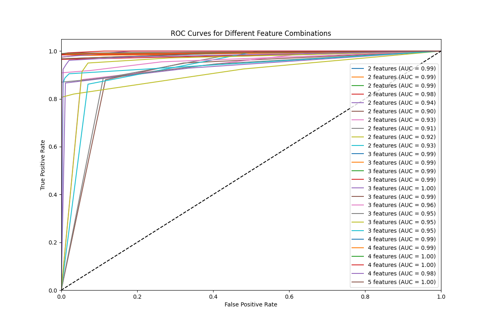

# Feature Entropy Analysis

## Class Entropy

Base class entropy: 0.9991

## Feature Information Gain Rankings

|    | Feature                  |   Information Gain |   Feature Entropy |   Conditional Entropy |
|----|--------------------------|--------------------|-------------------|-----------------------|
|  0 | odor                     |             0.9061 |            2.3194 |                0.093  |
|  1 | spore-print-color        |             0.4807 |            2.2032 |                0.5184 |
|  2 | gill-color               |             0.417  |            3.0304 |                0.5821 |
|  3 | stalk-root               |             0.4001 |            1.3463 |                0.5989 |
|  4 | ring-type                |             0.318  |            1.5351 |                0.681  |
|  5 | stalk-surface-above-ring |             0.2847 |            1.2213 |                0.7143 |
|  6 | stalk-surface-below-ring |             0.2719 |            1.3991 |                0.7272 |
|  7 | stalk-color-above-ring   |             0.2538 |            1.9368 |                0.7452 |
|  8 | stalk-color-below-ring   |             0.2414 |            1.9782 |                0.7577 |
|  9 | gill-size                |             0.2302 |            0.8923 |                0.7689 |
| 10 | population               |             0.202  |            2.0034 |                0.7971 |
| 11 | bruises?                 |             0.1924 |            0.9793 |                0.8067 |
| 12 | habitat                  |             0.1568 |            2.2747 |                0.8422 |
| 13 | gill-spacing             |             0.1009 |            0.6379 |                0.8982 |
| 14 | cap-shape                |             0.0488 |            1.6529 |                0.9503 |
| 15 | ring-number              |             0.0385 |            0.4207 |                0.9606 |
| 16 | cap-color                |             0.036  |            2.5101 |                0.963  |
| 17 | cap-surface              |             0.0286 |            1.5755 |                0.9705 |
| 18 | veil-color               |             0.0238 |            0.1962 |                0.9753 |
| 19 | gill-attachment          |             0.0142 |            0.1731 |                0.9849 |
| 20 | stalk-shape              |             0.0075 |            0.9869 |                0.9916 |
| 21 | veil-type                |             0      |            0      |                0.9991 |

## Top Features

1. **odor** (Information Gain: 0.9061)
2. **spore-print-color** (Information Gain: 0.4807)
3. **gill-color** (Information Gain: 0.4170)
4. **stalk-root** (Information Gain: 0.4001)
5. **ring-type** (Information Gain: 0.3180)

## KNN Classification Results

|    | Features                                                   |   N Features |   PR AUC |   ROC AUC |
|----|------------------------------------------------------------|--------------|----------|-----------|
|  0 | odor, spore-print-color                                    |            2 |   0.9965 |    0.9931 |
|  1 | odor, gill-color                                           |            2 |   0.9948 |    0.9902 |
|  2 | odor, stalk-root                                           |            2 |   0.9928 |    0.9887 |
|  3 | odor, ring-type                                            |            2 |   0.9911 |    0.9825 |
|  4 | spore-print-color, gill-color                              |            2 |   0.9578 |    0.9368 |
|  5 | spore-print-color, stalk-root                              |            2 |   0.9149 |    0.9004 |
|  6 | spore-print-color, ring-type                               |            2 |   0.9459 |    0.9318 |
|  7 | gill-color, stalk-root                                     |            2 |   0.9207 |    0.9105 |
|  8 | gill-color, ring-type                                      |            2 |   0.9474 |    0.9175 |
|  9 | stalk-root, ring-type                                      |            2 |   0.9371 |    0.9289 |
| 10 | odor, spore-print-color, gill-color                        |            3 |   0.9968 |    0.9938 |
| 11 | odor, spore-print-color, stalk-root                        |            3 |   0.9972 |    0.9944 |
| 12 | odor, spore-print-color, ring-type                         |            3 |   0.9965 |    0.9931 |
| 13 | odor, gill-color, stalk-root                               |            3 |   0.9959 |    0.9919 |
| 14 | odor, gill-color, ring-type                                |            3 |   0.998  |    0.9977 |
| 15 | odor, stalk-root, ring-type                                |            3 |   0.9929 |    0.9889 |
| 16 | spore-print-color, gill-color, stalk-root                  |            3 |   0.9778 |    0.965  |
| 17 | spore-print-color, gill-color, ring-type                   |            3 |   0.9651 |    0.946  |
| 18 | spore-print-color, stalk-root, ring-type                   |            3 |   0.9574 |    0.9506 |
| 19 | gill-color, stalk-root, ring-type                          |            3 |   0.9719 |    0.9491 |
| 20 | odor, spore-print-color, gill-color, stalk-root            |            4 |   0.9971 |    0.9943 |
| 21 | odor, spore-print-color, gill-color, ring-type             |            4 |   0.9968 |    0.9938 |
| 22 | odor, spore-print-color, stalk-root, ring-type             |            4 |   0.9977 |    0.9956 |
| 23 | odor, gill-color, stalk-root, ring-type                    |            4 |   0.9995 |    0.9994 |
| 24 | spore-print-color, gill-color, stalk-root, ring-type       |            4 |   0.9876 |    0.9815 |
| 25 | odor, spore-print-color, gill-color, stalk-root, ring-type |            5 |   0.9977 |    0.9955 |

## ROC Curves

